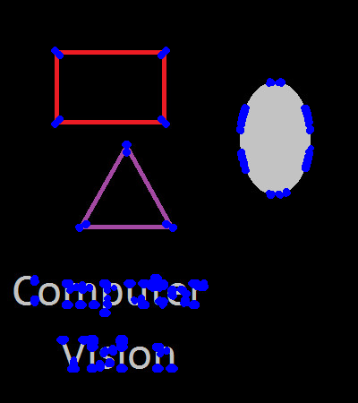
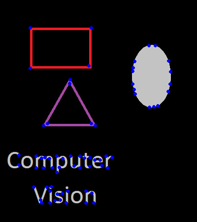
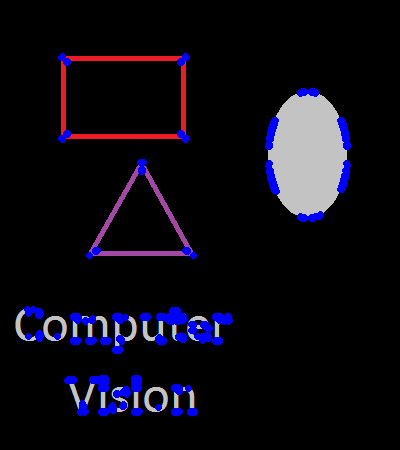

# Harris Corner Detector

This repository is implemented by Python3 and OpenCV. Fast, efficient and easy to read.

**Key features**:

1. Implemented by the built-in functions, no loop.
2. A simple non-maximum suppression (nms) for post processing.
3. The results are compared with the official OpenCV `cv2.cornerHarris` function.

Install the required packages by
```Python
pip3 install -r requirements.txt
```

To see the results of the demo image in `test/test0.jpg` by running
```Python
python3 harris_corner.py
```

### Results:

Detected Harris corners before NMS processing:



Detected Harris corners after NMS processing:



Detected Harris corners by official OpenCV function:




### Copyrights

If you use the codes in your work, please explicitly cite this repository. All rights reserved.